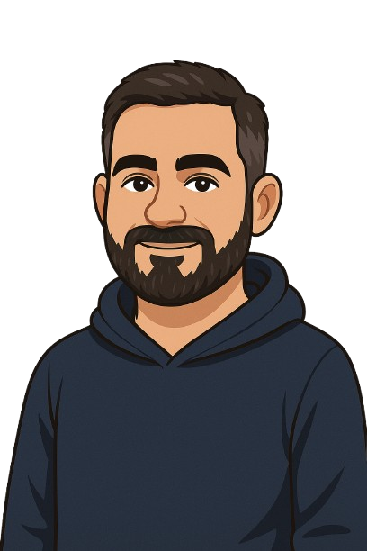

<!-- Avatar -->

  

<h1 align="center">👋 Hey! I'm Marcio Roberto</h1>

💻 Tech enthusiast exploring the world of code — always curious, always learning.

---

## 🚀 A Little About Me

- 🎓 Completed a **Python** course at [Tokio School](https://tokioschool.pt/)
- 🧠 Currently studying **C** at [42Porto](https://www.42porto.com/pt/)
- 📘 Learning more about **data structures and algorithms**
- 🌐 Got some hands-on experience with **HTML**, **CSS**, and the basics of **Django**
- 🎮 Considering a career in **game development**, but still exploring my path

---

## 🔗 Let's Connect

  
  
  

---

## 🛠️ Tech Stack

  

---

## 📊 GitHub Stats

  
  

---

## 🐍 Contribution Activity

  

---

## 🎯 A Few Things About Me

- ☕ I’m a coffee addict  
- 🎮 Big fan of gaming — especially on PC  
- 🍣 Into Japanese and Mexican food  
- ✈️ Traveling is one of my favorite ways to unwind  
- 🔍 Constantly looking to learn and improve

---

> Thanks for stopping by!  
> This README was crafted with curiosity, a bit of code, and a lot of coffee.  
> 💚 From **Marcio Roberto**